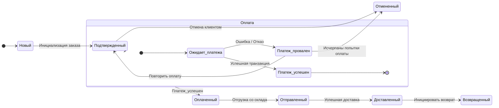
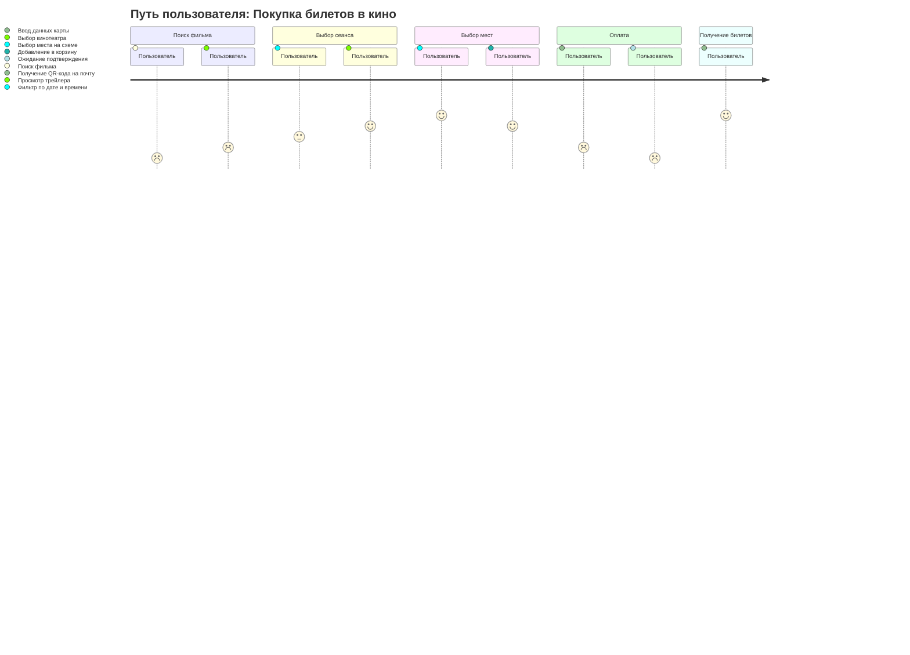
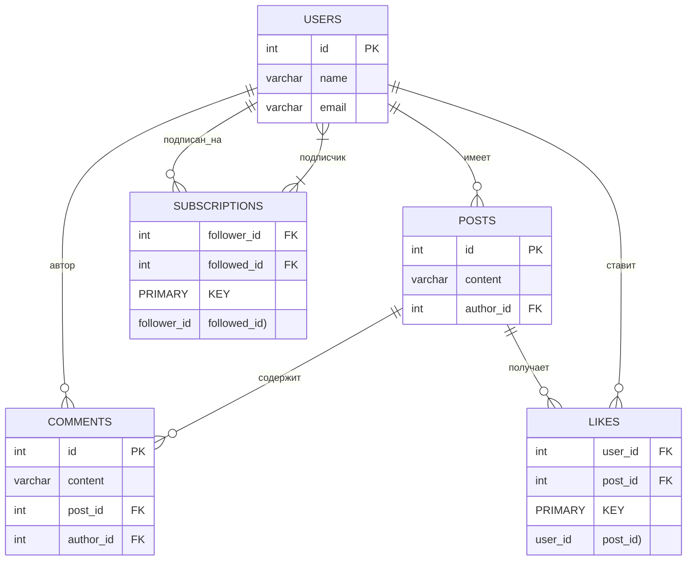
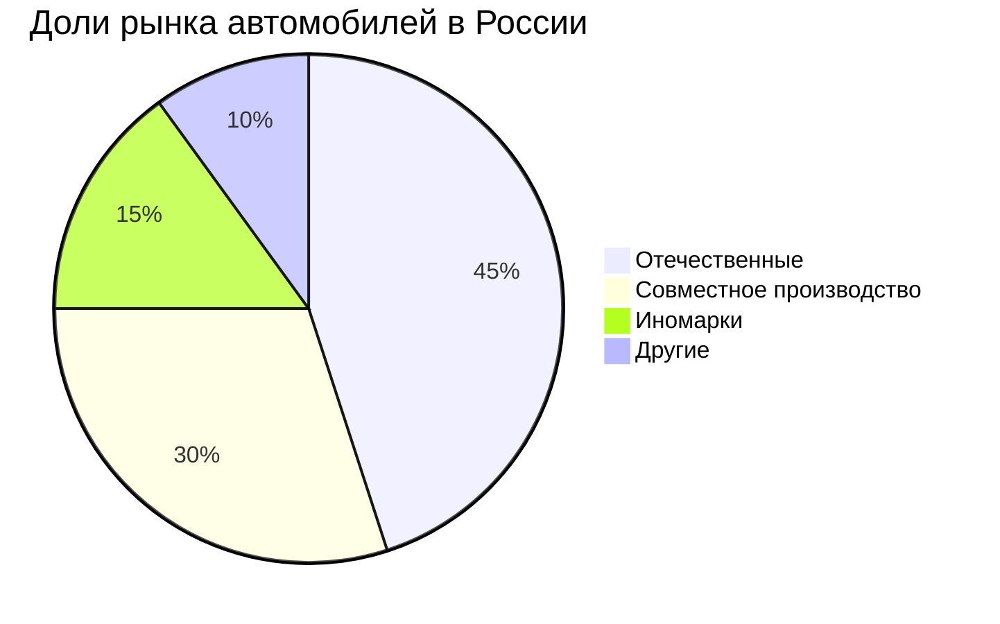

#   Диаграмма состояний

```mermaid
stateDiagram-v2
    direction LR
    
    [*] --> Новый
    
    Новый --> Подтвержденный : Инициализация заказа
    Подтвержденный --> Отмененный : Отмена клиентом
    
    Подтвержденный --> Оплата
    
    state Оплата {
        direction TB
        [*] --> Ожидает_платежа
        Ожидает_платежа --> Платеж_провален : Ошибка / Отказ
        Ожидает_платежа --> Платеж_успешен : Успешная транзакция
        Платеж_провален --> Подтвержденный : Повторить оплату
        Платеж_успешен --> [*]
    }
    
    Оплата --> Оплаченный : Платеж_успешен
    Платеж_провален --> Отмененный : Исчерпаны попытки оплаты
    
    Оплаченный --> Отправленный : Отгрузка со склада
    Отправленный --> Доставленный : Успешная доставка
    
    Доставленный --> Возвращенный : Инициировать возврат
```
---
# Экспертный

```mermaid
journey
    title Путь пользователя: Покупка билетов в кино

    section Поиск фильма
      Пользователь: 1: Поиск фильма
      Пользователь: 2: Просмотр трейлера

    section Выбор сеанса
      Пользователь: 3: Фильтр по дате и времени
      Пользователь: 4: Выбор кинотеатра
      
    section Выбор мест
      Пользователь: 5: Выбор места на схеме
      Пользователь: 4: Добавление в корзину

    section Оплата
      Пользователь: 2: Ввод данных карты
      Пользователь: 1: Ожидание подтверждения

    section Получение билетов
      Пользователь: 5: Получение QR-кода на почту
```
---
# ER-диаграмма базы данных

```mermaid
erDiagram
    USERS ||--o{ POSTS : "имеет"
    USERS ||--o{ COMMENTS : "автор"
    POSTS ||--o{ COMMENTS : "содержит"
    POSTS ||--o{ LIKES : "получает"
    USERS ||--o{ LIKES : "ставит"
    USERS ||--o{ SUBSCRIPTIONS : "подписан_на"
    SUBSCRIPTIONS }|--|{ USERS : "подписчик"

    USERS {
        int id PK
        varchar name
        varchar email
    }

    POSTS {
        int id PK
        varchar content
        int author_id FK
    }

    COMMENTS {
        int id PK
        varchar content
        int post_id FK
        int author_id FK
    }

    LIKES {
        int user_id FK
        int post_id FK
        PRIMARY KEY user_id post_id)
    }

    SUBSCRIPTIONS {
        int follower_id FK
        int followed_id FK
        PRIMARY KEY follower_id followed_id)
    }
```
---

```mermaid
pie title Доли рынка автомобилей в России
    "Отечественные" : 45
    "Совместное производство" : 30
    "Иномарки" : 15
    "Другие" : 10
```